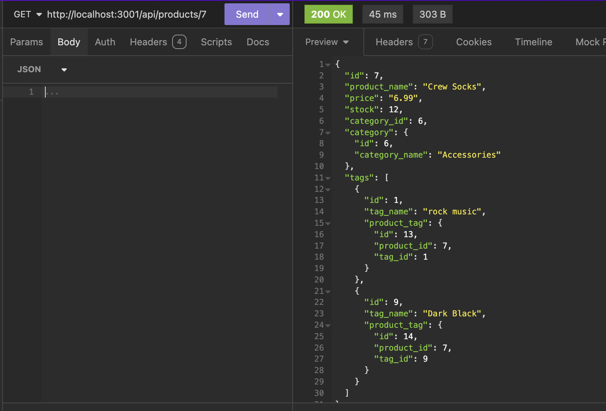

# e-commerce-back-end

## Description
This is a back-end application for an e-commerce site using Express.js for the API configuration, and Sequelize to interact with the PostgreSQL database.  I was given starter code and challenged to create the models and associations between them, as well as the routes to carry out all the CRUD operations.

## Table of Contents
* [Installation](#installation)
* [Usage](#usage)
* [License](#license)
* [Contributing](#contributing)
* [Credits](#credits)
* [Tests](#tests)
* [Questions](#questions)

## Installation
Installation instructions for application:
npm i

## Usage
Click [here]() for a video demonstration of the application.

To use this project, ensure Node.js and PostgreSQL are installed and clone repository.  Create a .env file to store credentials and install all dependencies according to the instructions in the installation section.  Using postgreSQL, run the schema file to create the database and the command npm run seed to seed the database.  Node server.js is the command to start the application.  With the server running, navigate to Insomnia or your preferred API client to interact with the application.  Perform GET/POST/PUT/DELETE requets using any of the api routes outlined in the application.  Add products, categories, and tags to organize your merchandise and view them all compiled together.  See the Models folder or video walkthrough for necessary components of each model. 

## License
This project is operating under the MIT license.  For more detailed information, please click [here](https://opensource.org/license/mit).

## Contributing
See my contact information 

## Credits
N/A

## Tests
To run tests for the application:
N/A

## Questions
Contact me for any questions regarding this project:

GitHub: [lindsay-terry](https://github.com/lindsay-terry)

Email: lindsaytee66@gmail.com
